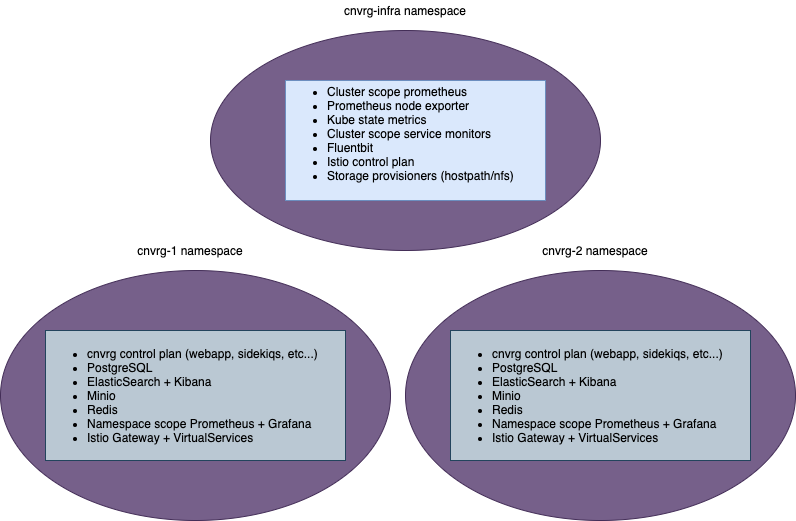

# cnvrg.io operator (v3)
---
## Deploy cnvrg stack on EKS | AKS | GKE | OpenShift | On-Premise clusters with K8s operator

### Architecture overview 
cnvrg operator may deploy cnvrg stack in two different ways
1. As a fully multi tenant K8s cluster - multiple cnvrg control plan instances in different namespaces


2. As a regula K8s cluster - single instance of cnvrg control plan in one namespace  

### Quick start
Setup multi tenant cnvrg cluster


### Build & Dev
Build docker image 
```
TAG=<docker-tag> make docker-build 
```
Push docker image
```
TAG=<docker-tag> make docker-push
```
Deploy operator
```
TAG=<docker-tag> make deploy
# use single command 
TAG=<docker-tag> make docker-build docker-push deploy
```

### `CnvrgInfra` example 
```shell
apiVersion: mlops.cnvrg.io/v1
kind: CnvrgInfra
metadata:
  name: cnvrginfra
spec:
  clusterDomain: <cluster-domain>
  registry:
    user: <user>
    password: <password>
```

### `CnvrgApp` example
```shell
apiVersion: mlops.cnvrg.io/v1
kind: CnvrgApp
metadata:
  name: cnvrgapp
  namespace: cnvrg-1
spec:
  clusterDomain: <cluster-domain>
  controlPlan:
    webapp:
      image: <cnvrg-app-image> 
    registry:
      user: <user>
      password: <password>
```